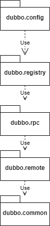

### 为什么想着要写这个框架


### 分为四层



config---配置层，基于spring整合配置，创建代理对象

registry---注册中心层，zookeeper服务注册服务发现

remote ---原层通信层，netty远程通信

protocol---协议层，心跳检测短线重连，数据的传输格式,负载均衡

common 公共依赖


test 测试模块

### netty为什么自己实现心跳检测，不是TCP的保活机制

IdleStateHandler

因为TCP只是确认这个连接是否还存在，netty还需要判断服务是否还能正常响应。比如，服务处于高负载，虽然连接存在，但是已经不能提供服务，那么就要选择其他的服务。

心跳检测一般存在于建立长连接 或者 需要保活的场景。

心跳的使用场景

**长连接**的应用场景非常的广泛，比如监控系统，IM系统，即时报价系统，**推送服务**等等。像这些场景都是比较注重**实时性**，如果每次发送数据都要进行一次DNS解析，建立连接的过程肯定是极其影响体验。

而**长连接的维护必然需要一套机制来控制**。比如 HTTP/1.0 通过在 header 头中添加 Connection:Keep-Alive参数，如果当前请求需要保活则添加该参数作为标识，否则服务端就不会保持该连接的状态，发送完数据之后就关闭连接。HTTP/1.1以后 Keep-Alive 是默认打开的。

Netty 是 基于 TCP 协议开发的，在四层协议 TCP 协议的实现中也提供了 keepalive 报文用来探测对端是否可用。TCP 层将在定时时间到后发送相应的 KeepAlive 探针以确定连接可用性。

tcp-keepalive，操作系统内核支持，但是不默认开启,应用需要自行开启，开启之后有三个参数会生效，来决定一个 keepalive 的行为。

```
net.ipv4.tcp_keepalive_time = 7200 

net.ipv4.tcp_keepalive_probes = 9

net.ipv4.tcp_keepalive_intvl = 75
```

tcp_keepalive_time： 在 TCP 保活打开的情况下，最后一次数据交换到 TCP 发送第一个保活探测包的间隔，即允许的持续空闲时长，或者说每次正常发送心跳的周期，默认值为7200s（2h）；

tcp_keepalive_probes： 在 tcp_keepalive_time 之后，没有接收到对方确认，继续发送保活探测包次数，默认值为9（次）；

tcp_keepalive_intvl：在 tcp_keepalive_time 之后，没有接收到对方确认，继续发送保活探测包的发送频率，默认值为75s。

TCP KeepAlive 是用于检测连接的死活，而心跳机制则附带一个额外的功能：检测通讯双方的存活状态。两者听起来似乎是一个意思，但实际上却大相径庭。

考虑一种情况，某台服务器因为某些原因导致**负载超高，CPU 100%，无法响应任何业务请求**，但是使用 **TCP 探针则仍旧能够确定连接状态**，这就是典型的连接活着但业务**提供方已死**的状态，对客户端而言，这时的最好选择就是断线后重新连接其他服务器，而不是一直认为当前服务器是可用状态一直向当前服务器发送些必然会失败的请求。

Netty 中也提供了设置 tcp-keepalive 的设置：


设置：ChannelOption.SO_KEEPALIVE, true 表示打开 TCP 的 keepAlive 设置。

所以基础协议对应用来说不是那么尽善尽美，一个 Netty 服务端可能会面临上万个连接，如何去维护这些连接是应用应该去处理的事情。在 Netty 中提供了 IdleStateHandler 类专门用于处理心跳。

IdleStateHandler 的构造函数如下：

public IdleStateHandler(long readerIdleTime, long writerIdleTime, long allIdleTime,TimeUnit unit){ }
第一个参数是隔多久检查一下读事件是否发生，如果 channelRead() 方法超过 readerIdleTime 时间未被调用则会触发超时事件调用 userEventTrigger() 方法；

第二个参数是隔多久检查一下写事件是否发生，writerIdleTime 写空闲超时时间设定，如果 write() 方法超过 writerIdleTime 时间未被调用则会触发超时事件调用 userEventTrigger() 方法；

第三个参数是全能型参数，隔多久检查读写事件；

第四个参数表示当前的时间单位。

所以这里可以分别控制读，写，读写超时的时间，单位为秒，如果是0表示不检测，所以如果全是0，则相当于没添加这个 IdleStateHandler，连接是个普通的短连接。

Netty 中的心跳逻辑#

下面演示一下在 Netty 中如果使用 IdleStateHandler